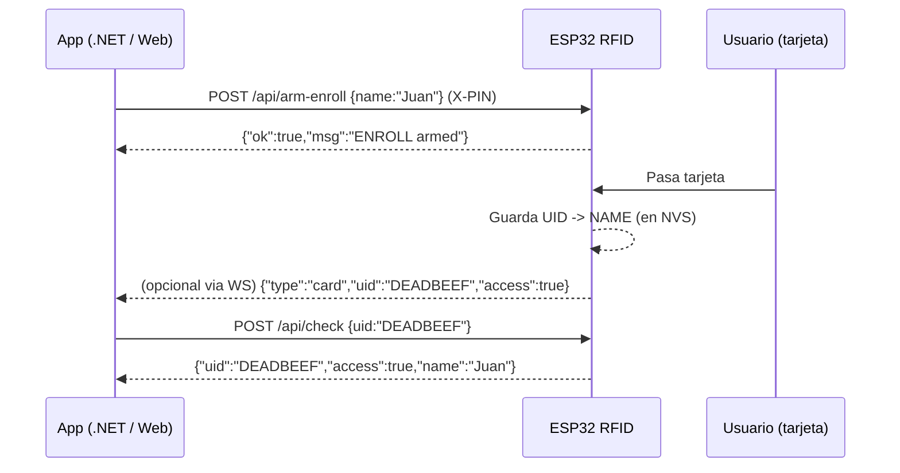

# ESP32 RFID Enroll

Firmware para **ESP32 + RC522** que permite enrolar, gestionar y validar tarjetas RFID.  
Incluye un **servidor web embebido** con interfaz básica y una **API REST** para integrarse con aplicaciones externas (.NET, web, mobile, etc.).  
También incluye una consola serie para desarrollo (comandos: `ENROLL`, `DELETE`, `SEND`, `CHECK`, `LIST`, `UNARM`).

---

## 📡 Conexión / Requisitos

- **Protocolo:** HTTP (LAN)  
- **Puerto:** 80  
- **Base URL:** `http://<IP_DEL_ESP32>` (ej: `http://192.168.0.23`)  
  - Si usás mDNS y lo activaste: `http://esp32.local`  
- **Formato:** JSON para la API  
- **Auth mínima:** Header `X-PIN: <pin>` para operaciones sensibles (enrolar / borrar)  
- **Plataforma de compilación:** PlatformIO (VSCode) — `platformio.ini` incluido en el proyecto.

---

## 🔧 Interacción local (Serial Monitor)

El firmware incluye un módulo de control por serie para desarrollo. Abrí el monitor serie (115200) y podés enviar comandos por texto:

**Comandos disponibles**
- `ENROLL <name>` — arma enrolar: la próxima tarjeta que pases se guarda con `name`.  
- `DELETE` — arma borrar: la próxima tarjeta que pases se eliminará.  
- `SEND` — la próxima tarjeta leída será reportada por serie (UID + si tiene acceso).  
- `CHECK <UID>` — chequea si `UID` tiene acceso (imprime resultado).  
- `LIST` — lista todas las tarjetas en CSV (`UID,NAME`).  
- `UNARM` — cancela modos armados.  
- `HELP` — muestra ayuda.

**Usar con PlatformIO (terminal):**
```bash
# Abrir monitor con envío en Enter:
pio device monitor -b 115200 --filter send_on_enter --eol LF --echo
# O configurar en platformio.ini:
# monitor_speed = 115200
# monitor_filters = send_on_enter
# monitor_eol = LF
# monitor_echo = yes
```

Al iniciar, verás un banner tipo:
```
[SerialControl] listo. Comandos: ENROLL <name>, DELETE, UNARM, SEND, CHECK <UID>, LIST
```

---

## 🔑 API REST (resumen único)

> Todas las respuestas JSON. Para endpoints que requieren PIN, enviar header `X-PIN: <pin>`.

### GET `/api/status`
Estado general
```json
{
  "ip": "192.168.0.23",
  "armed": { "enroll": true, "delete": false },
  "cardsCount": 12
}
```

---

### GET `/api/cards`
Lista todas las tarjetas
```json
[
  { "uid": "DEADBEEF", "name": "Juan" },
  { "uid": "33364BAC", "name": "Visita" }
]
```

---

### POST `/api/arm-enroll`
Arma el enrolamiento: la **próxima** tarjeta que passe se guardará con el `name`.

- Headers: `X-PIN: 1234`
- Body (JSON):
```json
{ "name": "Juan" }
```
- Respuesta:
```json
{ "ok": true, "msg": "ENROLL armed" }
```

---

### POST `/api/arm-delete`
Arma la baja: la **próxima** tarjeta que passe será eliminada.

- Headers: `X-PIN: 1234`
- Body: *(vacío)*
- Respuesta:
```json
{ "ok": true, "msg": "DELETE armed" }
```

---

### POST `/api/delete`
Borra una tarjeta por UID directamente.

- Headers: `X-PIN: 1234`
- Body (JSON):
```json
{ "uid": "DEADBEEF" }
```
- Respuesta OK:
```json
{ "ok": true }
```
- Respuesta si no existe:
```json
{ "ok": false, "error": "not_found" }
```

---

### POST `/api/check`
Chequea si un UID tiene acceso.

- Body (JSON):
```json
{ "uid": "DEADBEEF" }
```
- Respuesta (si existe):
```json
{ "uid": "DEADBEEF", "access": true, "name": "Juan" }
```
- Respuesta (si NO existe):
```json
{ "uid": "33364BAC", "access": false }
```

---

### POST `/api/send`
Modo test: arma el reporte de la próxima tarjeta (el dispositivo puede imprimir en serial o emitir evento).

- Body: *(vacío)*
- Respuesta:
```json
{ "ok": true }
```

---

## ⚠️ Códigos de error

- `200 OK` — operación exitosa.  
- `204 No Content` — respuesta a `OPTIONS` (CORS).  
- `400 Bad Request` — JSON inválido o campos faltantes.  
- `403 Forbidden` — PIN inválido o ausente (endpoints sensibles).  
- `404 Not Found` — UID inexistente (al borrar).  
- `500 Internal Server Error` — error inesperado.

---

## 📱 Ejemplos prácticos

### cURL
```bash
# Estado
curl http://esp32.local/api/status

# Listar tarjetas
curl http://esp32.local/api/cards

# Armar enrolamiento
curl -X POST http://esp32.local/api/arm-enroll   -H "Content-Type: application/json" -H "X-PIN: 1234"   -d '{"name":"Juan"}'

# Armar baja
curl -X POST http://esp32.local/api/arm-delete -H "X-PIN: 1234"

# Borrar por UID
curl -X POST http://esp32.local/api/delete   -H "Content-Type: application/json" -H "X-PIN: 1234"   -d '{"uid":"DEADBEEF"}'

# Chequear acceso
curl -X POST http://esp32.local/api/check   -H "Content-Type: application/json"   -d '{"uid":"33364BAC"}'
```

---

### Cliente .NET (HttpClient) — ejemplo minimal
```csharp
using System.Net.Http.Json;

public sealed class EspClient {
    private readonly HttpClient _http;
    private readonly string? _pin;

    public EspClient(string baseUrl, string? pin = null) {
        _http = new HttpClient { BaseAddress = new Uri(baseUrl.TrimEnd('/') + "/"), Timeout = TimeSpan.FromSeconds(5) };
        _pin = pin;
    }

    private void AddPinHeader(HttpRequestMessage req) {
        if (!string.IsNullOrEmpty(_pin)) req.Headers.Add("X-PIN", _pin);
    }

    public Task<EspStatus?> GetStatusAsync(CancellationToken ct = default)
        => _http.GetFromJsonAsync<EspStatus>("api/status", ct);

    public Task<List<CardDto>?> GetCardsAsync(CancellationToken ct = default)
        => _http.GetFromJsonAsync<List<CardDto>>("api/cards", ct);

    public async Task<OkResponse?> ArmEnrollAsync(string name, CancellationToken ct = default) {
        var req = new HttpRequestMessage(HttpMethod.Post, "api/arm-enroll") { Content = JsonContent.Create(new { name }) };
        AddPinHeader(req);
        var res = await _http.SendAsync(req, ct);
        res.EnsureSuccessStatusCode();
        return await res.Content.ReadFromJsonAsync<OkResponse>(cancellationToken: ct);
    }

    public async Task<OkResponse?> ArmDeleteAsync(CancellationToken ct = default) {
        var req = new HttpRequestMessage(HttpMethod.Post, "api/arm-delete");
        AddPinHeader(req);
        var res = await _http.SendAsync(req, ct);
        res.EnsureSuccessStatusCode();
        return await res.Content.ReadFromJsonAsync<OkResponse>(cancellationToken: ct);
    }

    public async Task<OkResponse?> DeleteByUidAsync(string uid, CancellationToken ct = default) {
        var req = new HttpRequestMessage(HttpMethod.Post, "api/delete") { Content = JsonContent.Create(new { uid = uid.ToUpperInvariant() }) };
        AddPinHeader(req);
        var res = await _http.SendAsync(req, ct);
        if (res.StatusCode == System.Net.HttpStatusCode.NotFound) return await res.Content.ReadFromJsonAsync<OkResponse>(cancellationToken: ct);
        res.EnsureSuccessStatusCode();
        return await res.Content.ReadFromJsonAsync<OkResponse>(cancellationToken: ct);
    }

    public async Task<CheckResponse?> CheckAsync(string uid, CancellationToken ct = default) {
        var res = await _http.PostAsJsonAsync("api/check", new { uid = uid.ToUpperInvariant() }, ct);
        res.EnsureSuccessStatusCode();
        return await res.Content.ReadFromJsonAsync<CheckResponse>(cancellationToken: ct);
    }

    public Task<OkResponse?> SendNextAsync(CancellationToken ct = default)
        => _http.PostAsync("api/send", null, ct).ContinueWith(t => t.Result.Content.ReadFromJsonAsync<OkResponse>(cancellationToken: ct)).Unwrap();
}

// DTOs
public sealed class EspStatus { public string Ip { get; set; } = ""; public ArmedState Armed { get; set; } = new(); public int CardsCount { get; set; } 
    public sealed class ArmedState { public bool Enroll { get; set; } public bool Delete { get; set; } } }
public sealed class CardDto { public string Uid { get; set; } = ""; public string Name { get; set; } = ""; }
public sealed class OkResponse { public bool Ok { get; set; } public string? Msg { get; set; } public string? Error { get; set; } }
public sealed class CheckResponse { public string Uid { get; set; } = ""; public bool Access { get; set; } public string? Name { get; set; } }
```

---

## ✅ Buenas prácticas y recomendaciones

- **UIDs:** siempre en HEX mayúscula, sin espacios (ej: `DEADBEEF`).  
- **Timeouts:** configurar timeouts cortos (2–5 s) y reintentos moderados en la app cliente.  
- **Seguridad:** `X-PIN` es un control mínimo — si el dispositivo queda accesible fuera de LAN, agregar autenticación más fuerte (token/Bearer, reverse proxy HTTPS + auth).  
- **Consumo automático:** después de usar `arm-enroll` o `arm-delete`, la acción se **consume** cuando pase una tarjeta (se desarma).  
- **Logs ruidosos:** el firmware evita logs innecesarios de `Preferences` leyendo con `isKey()` para no spamear la consola.

---

## 🚀 Roadmap (posibles mejoras)

- WebSocket / Server-Sent Events (SSE) para recibir eventos en tiempo real (`{"type":"card","uid":"..."}`).  
- Export / Import de tarjetas en CSV desde el Web UI.  
- Autenticación fuerte y UI con login.  
- Endpoint para descargar backup JSON de todas las tarjetas.

---

## 📊 Diagrama de flujo (simplificado)



